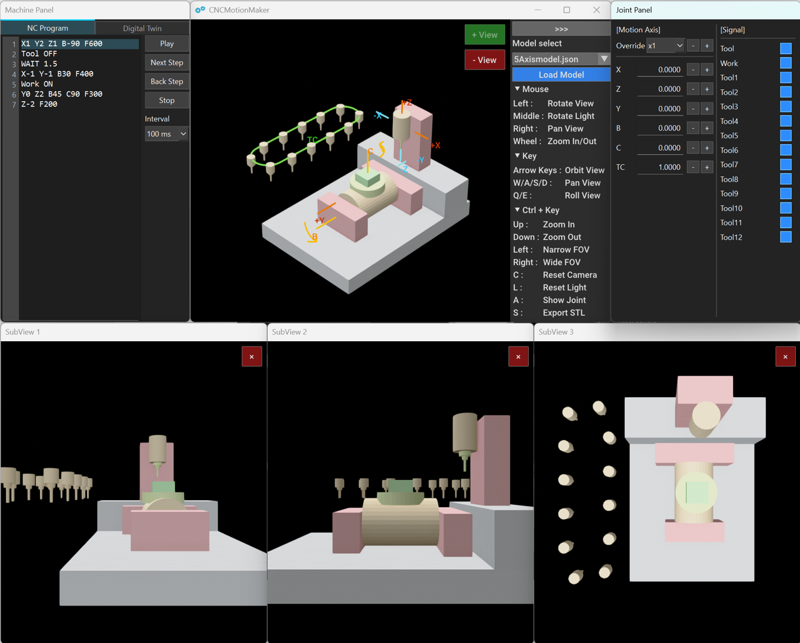

# CNCMotionMaker

An open-source CNC machine motion visualization and Digital Twin platform built with Open3D.


<p align="center">
  
</p>
Visualize CNC machine motion, execute NC programs, and develop Digital Twin applications with a JSON-based machine definition.

## Overview

CNCMotionMaker is an open-source desktop application for visualizing CNC machine motion.

Machine structures are defined in JSON and rendered using Open3D.

The project focuses on machine visualization, Digital Twin development, and future CNC simulation.

## Features

### Machine Definition
- JSON-based machine definition
- Hierarchical machine structure
- Linear / Rotary / Signal / Chain joints

### Motion Visualization
- Multi-window Open3D viewer
- Joint axis visualization
- Camera tracking

### NC Programming
- NC program playback using a custom NC DSL

### Digital Twin
- Connect to CNC devices (requires the FANUC FOCAS library)

### Export
- STL export

## Installation

```bash
git clone ...

cd CNCMotionMaker

pip install -r requirements.txt

python main.py
```
## License

MIT License
